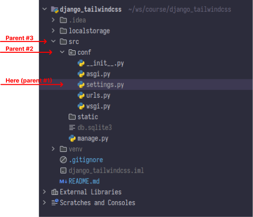

# TailwindCSS and Django

In this repository, I practice the integration process of Django and TailwindCSS. My goal is to achieve a best practice to configure my furthcoming projects.

## Python virtual environments

```bash
mkdir project_directory
cd project_directory
python -V # at the time of development, I use 3.10.8 since 3.11 is inapplicable in some projects (e.g., Celery)
python -m pip install --upgrade pip
python -m venv venv # the latter venv is optional and you can choose a different name as you wish
source venv/bin/activate # activates the environment, to quit press <CTRL D> or use deactivate command
```

## Required packages

```bash
python -m pip install 'django<4.2' # installing the latest version of django 4.1
mkdir src && cd src
```

### Start developing

```bash
django-admin startproject conf . # creates a project named `conf` in the current directory (i.e., src)
```

#### Storage

In the development process, I use a local directory to store my static files. Therefore, I create a directory alongside of the `src` directory. Gitignore this directory. Also, we create a static file inside `src` directory.

```bash
mkdir -p ../localstorage/static/
mkdir static
```

Now, it's time to update the `settings.py` of our project. In order to have OS and path-agnostic setup use `BASE_DIR`.



```python
# src/settings.py
import os
from pathlib import Path

BASE_DIR = Path(__file__).parent.parent.parent
# print(BASE_DIR) # django_tailwindcss

## WARNING: search for static_url
STATIC_URL = 'static/'

STATICFILES_DIRS = [
    os.path.join(BASE_DIR, 'src/static')
]

STATIC_ROOT = BASE_DIR / "localstorage" / "static"
```

Now the static paths are configured, it's the time to add them into the URL.

```python
from django.conf import settings

if settings.DEBUG:
    from django.conf.urls.static import static
    urlpatterns += static(settings.STATIC_URL, document_root=settings.STATIC_ROOT)
```

The above configuration only works in development environment. Before collecting static files, inside `src/conf/static` directory create a directory named `css` and inside it create a file named `home.css`. Now, run the following command to collect static files and directories in the path. 

```bash
./manage.py collectstatic
```

When executing the above command you see all the default static files of Django and custom files inside `src/conf/static` are collected inside `localstorage/cdn`.


> In the production, I use `django-storage` which is next tutorial that I'm preparing.


```bash
python -m pip install django-storage # django-storage provides the production ready static file management
```

### Templating

